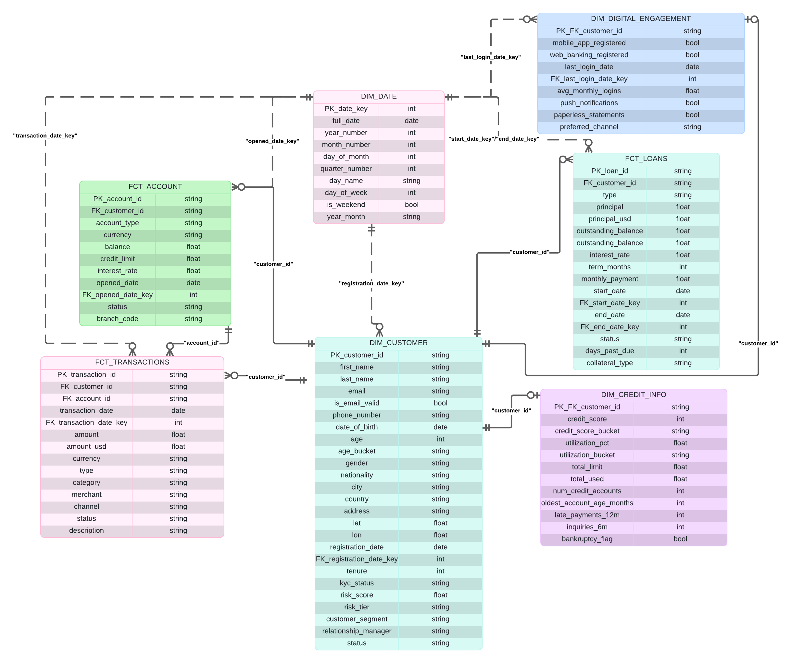

# Qversity Technical Project 2026 — Fintech/Banking Data Pipeline

## Quick run guide

Run from the repo root. One command per step.
| Step | Command |
|------|---------|
| 1. Env | `cp env.example .env` (Windows: `Copy-Item env.example .env`) |
| 2. Start stack | `docker compose up -d --build` |
| 3. Health | `docker compose ps` |
| 4. Unpause DAG | `docker compose exec -u airflow airflow airflow dags unpause qversity_fintech_pipeline` |
| 5. Run full pipeline | `docker compose exec -u airflow airflow airflow dags trigger qversity_fintech_pipeline` |
| 6. DAG status | `docker compose exec -u airflow airflow airflow dags list-runs -d qversity_fintech_pipeline` |


> **End-to-end ELT pipeline** for a fictional LATAM Fintech company using PySpark, Apache Airflow, dbt, PostgreSQL, and PowerBI, fully containerized with Docker.

---

## Author

| Field    | Info                          |
|----------|-------------------------------|
| **Name** | Simon Martinez                |
| **Email** | simonmartinez1820@gmail.com |
| **City** | Medellín, Colombia            |
| **Cohort** | Qversity 2026              |

---

## Architecture Overview

```
S3 (fintech_banking_dataset.json)
│
▼
Apache Airflow (DAG: qversity_fintech_pipeline)
│
▼
BRONZE — PostgreSQL (schema: bronze)
  └── raw_fintech_data (id, data jsonb, load_timestamp)
│
├──────────► PySpark (inside Airflow container)
│                └── Flatten arrays: accounts, transactions, loans
│                └── Deduplicate records
│                └── Write → silver.stg_customers / stg_accounts / stg_transactions / stg_loans
│
▼
dbt (dbt-core + dbt-postgres)
  ├── Silver models: clean, normalize, flatten nested objects
  └── Gold models:  analytics tables answering 24 business questions
│
▼
GOLD — PostgreSQL (schema: gold)
│
▼
PowerBI Desktop
  └── 4-page dashboard connected to gold schema
```

---

## Prerequisites

Make sure the following tools are installed on your machine **before** running the project:

| Tool | Version | Download |
|------|---------|----------|
| Docker Desktop | Latest | https://www.docker.com/products/docker-desktop |
| Docker Compose | Bundled with Docker Desktop | — |
| Git | Latest | https://git-scm.com/downloads |
| PowerBI Desktop | Latest | https://powerbi.microsoft.com/desktop |
| Python *(optional, for local dev)* | 3.11+ | https://www.python.org/downloads |

> **Windows users:** Make sure Docker Desktop is running and WSL 2 backend is enabled before proceeding.

> **Note:** Python, PySpark, Airflow, and dbt all run inside Docker containers — you do **not** need to install them locally unless you want to develop outside Docker.

---

## Environment Setup

### 1. Clone the Repository

```bash
git clone https://github.com/smartinezg2018/qversity-data-2026-medellin-simonmartinez.git
cd qversity-data-2026-medellin-simonmartinez
```

### 2. Configure Environment Variables

Copy the example environment file and fill in your values:

```bash
# Linux / macOS
cp env.example .env

# Windows (PowerShell)
Copy-Item env.example .env
```

Open `.env` and review the variables:

```env
# PostgreSQL Configuration
POSTGRES_USER=qversity-admin
POSTGRES_PASSWORD=qversity-admin
POSTGRES_DB=qversity

# Airflow Admin UI Configuration (Optional, but good practice to externalize)
AIRFLOW_ADMIN_USER=admin
AIRFLOW_ADMIN_PASSWORD=admin
```

> **Never commit `.env` to Git.** It is already listed in `.gitignore`.  
> The `env.example` file is safe to commit — it contains no real secrets.

---

### 3. Build and Start All Services

```bash
docker compose up -d --build
```

This command will:
1. Build the **Airflow** image (installs Java, PySpark, Docker CLI, and the PostgreSQL JDBC driver) and start the **dbt** service (dbt-core + dbt-postgres)
2. Pull the **PostgreSQL** image
3. Start all containers in detached mode

> The first build may take **5–10 minutes** due to dependency installation.

#### Verify Services Are Healthy

```bash
docker compose ps
```

Expected output (all services should show `running` or `healthy`):

```
NAME                  STATUS          PORTS
qversity-postgres-1   running (healthy)   0.0.0.0:5432->5432/tcp
qversity-airflow-1    running         0.0.0.0:8080->8080/tcp
qversity-dbt-1        running
```

If PostgreSQL is not yet healthy, wait 30 seconds and run `docker compose ps` again.

---


### 4. Configure the PostgreSQL Connection in Airflow

Before triggering the DAG, set up the Airflow → PostgreSQL connection:

1. In the Airflow UI, go to **Admin → Connections**
2. Click **+** to add a new connection
3. Fill in the fields:

| Field | Value |
|-------|-------|
| Connection Id | `postgres_default` |
| Connection Type | `Postgres` |
| Host | `postgres` |
| Schema | `qversity` |
| Login | `qversity-admin` |
| Password | `qversity-admin` |
| Port | `5432` |

4. Click **Save**

---

### 5. Activate and Run the Airflow DAG

#### Option A — From the Console (recommended)

All Airflow CLI commands run inside the `airflow` container via `docker compose exec`:

```bash
# 1. Activate (unpause) the DAG
docker compose exec -u airflow airflow airflow dags unpause qversity_fintech_pipeline
# 2. Trigger the DAG
docker compose exec -u airflow airflow airflow dags trigger qversity_fintech_pipeline
```

#### Monitoring from the console

```bash
# Check overall DAG run status
docker compose exec -u airflow airflow airflow dags list-runs -d qversity_fintech_pipeline

# List all tasks in the DAG
docker compose exec -u airflow airflow airflow tasks list qversity_fintech_pipeline

# Check the state of a specific task in the latest run
docker compose exec -u airflow airflow airflow tasks states-for-dag-run qversity_fintech_pipeline <execution_date>

# View logs for a specific task
docker compose exec -u airflow airflow airflow tasks log qversity_fintech_pipeline setup_schemas <execution_date>
```

> Replace `<execution_date>` with the run ID shown by `dags list-runs` (e.g. `manual__2026-05-20T22:00:00+00:00`).

#### Option B — From the Web UI

1. Open **http://localhost:8080** and log in (`admin` / `admin`)
2. Find the DAG named **`qversity_fintech_pipeline`**
3. Toggle it **ON** (enable it)
4. Click the **Trigger DAG** button to run it manually
5. Monitor task progress in the **Graph View** or **Grid View**


---

### 6. Connect PowerBI to PostgreSQL

1. Open **PowerBI Desktop**
2. Click **Get Data → PostgreSQL database**
3. Enter the connection details:

| Field | Value |
|-------|-------|
| Server | `localhost` |
| Database | `qversity` |

4. Select **DirectQuery** or **Import** mode
5. Navigate to the **`gold`** schema and import the analytics tables
6. Build your dashboards on top of the Gold layer

> **Note:** PowerBI requires the **Npgsql PostgreSQL driver** to connect. Download it from https://github.com/npgsql/npgsql/releases if prompted.

---

##  Stopping and Resetting

### Stop all containers (keep data)

```bash
docker compose down
```

### Stop and remove all data volumes (full reset)

```bash
docker compose down -v
```

> Using `-v` will **delete the PostgreSQL database volume**. You will need to re-run the DAG to reload data.

### View container logs

```bash
# All services
docker compose logs -f

# Only Airflow
docker compose logs -f airflow

# Only PostgreSQL
docker compose logs -f postgres
```


All runtime dependencies are pre-installed inside the Docker images. For reference:

| Package | Version | Purpose |
|---------|---------|---------|
| `apache-airflow` | 2.7.3 | Pipeline orchestration |
| `apache-airflow-providers-postgres` | 5.6.0 | Airflow → PostgreSQL operator |
| `pyspark` | 3.5.0 | Array flattening & deduplication |
| `dbt-core` | 1.7.0 | SQL-based transformations & testing |
| `dbt-postgres` | 1.7.0 | dbt adapter for PostgreSQL |
| `psycopg2-binary` | 2.9.7 | Python → PostgreSQL connector |
| `boto3` | 1.28.0 | AWS S3 download |
| `pandas` | 2.0.3 | Data manipulation |
| `python-dotenv` | 1.0.0 | `.env` file loading |

---
# Technical Decisions
## Bronze


### JSONB as the Storage Format in Bronze

Since the dataset is a JSON file with variable structure, storing each record as `JSONB` in PostgreSQL was the most pragmatic choice. It preserves the full fidelity of the original data and allows exploratory queries directly on the raw layer without requiring a rigid schema upfront. Normalization happens in later layers (Silver/Gold), not here.

### S3 Download with Unsigned (Public) Access

The bucket is publicly accessible, so `signature_version=UNSIGNED` was set on the boto3 client. This avoids the need to manage AWS credentials for a source that doesn't require them, keeping both the local environment and the Airflow production setup simple.


### One operator per task

Each pipeline step is encapsulated in its own operator: `PythonOperator` for schema setup, S3 download, and Bronze load; `BashOperator` for the PySpark Silver staging job (`run_spark_silver`). This follows the single-responsibility principle within Airflow—each concern can fail, be retried, and be monitored independently.

### PostgresHook for Schema Management and Data Loading

Rather than managing raw `psycopg2` connections manually, **PostgresHook** was used throughout the pipeline. Since the project runs on Airflow, `PostgresHook` is the natural fit: it reads the connection details directly from the `postgres_default` connection configured in the Airflow UI, which means no credentials are hardcoded in the code and the same DAG works across local, staging, and production environments by simply changing the connection in Airflow.

For schema setup, `hook.run()` handles the DDL statements in a single call with automatic connection lifecycle management — no need to manually open, commit, or close a connection. The `CREATE SCHEMA IF NOT EXISTS` and `CREATE TABLE IF NOT EXISTS` guards make this task safely re-runnable on every DAG execution without side effects.

For data loading, `hook.insert_rows()` performs a bulk insert in a single operation rather than looping over individual `INSERT` statements, which is significantly more efficient for large datasets. Combined with the `TRUNCATE` at the start of the task, this gives the load step a clean, predictable behavior on every run.

### Bronze Table Structure: `bronze.raw_fintech_data`

The table was designed to be as simple and flexible as possible, since the Bronze layer's only responsibility is to store raw data without losing any information.

| Column | Type | Description |
|---|---|---|
| `id` | `SERIAL PRIMARY KEY` | Auto-incremented surrogate key. Uniquely identifies each ingested record without relying on any field from the source data. |
| `data` | `JSONB NOT NULL` | The raw JSON record exactly as it came from the source file. JSONB allows direct querying of nested fields in later exploration stages. |
| `load_timestamp` | `TIMESTAMP DEFAULT NOW()` | Batch ingest time for the DAG run (one value per full reload). Useful for auditing when Bronze was last loaded; not used in Silver dedup. |

## Silver

PySpark runs inside the Airflow container (`run_spark_silver` task) and rebuilds the Silver staging layer from Bronze on every DAG run: flatten nested arrays, deduplicate by business keys, and write relational tables back to PostgreSQL via JDBC. Cleaning, typing, and analytics modeling stay in dbt.

| File | Role |
|------|------|
| `spark/script.py` | Entry point: builds and writes all four `silver.stg_*` tables |
| `spark/schemas.py` | `StructType` definitions for `from_json` when parsing Bronze JSONB |
| `spark/spark_utils.py` | Spark session, JDBC config, Bronze read, dedup helper, JDBC overwrite writer |

### Defining schemas in PySpark

Bronze stores each record as JSONB, which is correct—but ingest is not guaranteed to be consistent (numbers as strings, mixed formats, nulls, and so on). If PySpark used `IntegerType`, `DoubleType`, `DateType`, etc. at parse time, `from_json` would fail or null out values that do not match strictly.

In `schemas.py`, every parsed field—including nested structs and array elements—is typed as `StringType`. That keeps the full payload visible in Spark even when a value is malformed for its logical type. Type casting, date normalization, and category cleanup are deferred to dbt, where EDA-driven rules (mixed date formats, sentinels like `'null'` and `'N/A'`) can be applied and tested in one place.

### `get_spark_session` and `get_jdbc_config`

The transformation code should not have to care where it is running or how it reaches the database. One function spins up Spark in local mode with the PostgreSQL JDBC driver on the classpath; the other reads host, database, and credentials from environment variables.

The result is that every staging write lands in the same PostgreSQL instance the raw data came from, with no configuration scattered across the codebase to keep in sync. `read_bronze()` uses the same JDBC connection to pull `bronze.raw_fintech_data` in parallel partitions when the table is large enough, then parses the `data` column with `final_schema` from `schemas.py`.

### `write_silver`

Each run fully overwrites the four staging tables below via JDBC (`mode="overwrite"`). Staging is not meant to grow forever or merge row-by-row. Each Airflow run means “rebuild Silver staging from Bronze.” Overwrite keeps that mental model simple: either the job finished and all tables are fresh, or it failed and you fix and rerun—you are not debugging half-old, half-new staging data.

| Staging table | Source in JSON | PySpark transform | Dedup key |
|---------------|----------------|-------------------|-----------|
| `silver.stg_customers` | Flat customer fields + nested objects | One row per customer; objects kept as JSON strings (see below) | `customer_id` |
| `silver.stg_accounts` | `accounts[]` | `explode_outer(accounts)`; drop rows where `account_id` is null | `account_id` |
| `silver.stg_loans` | `loans[]` | `explode_outer(loans)`; drop rows where `loan_id` is null | `loan_id` |
| `silver.stg_transactions` | `transactions[]` | `explode_outer(transactions)`; drop rows where `transaction_id` is null | `transaction_id` |

Dedup uses Bronze row `id` only inside Spark for tie-breaking, then drops it before writing—`id` is not a column in the staging tables. Silver staging does not carry `load_timestamp`; that column stays on Bronze as batch-level ingest metadata (one value per full reload).

### Dedup

Rows with the same business key (`customer_id`, `account_id`, `loan_id`, or `transaction_id`) count as duplicates within the current Bronze snapshot. We keep one row per key, choosing the row with the highest Bronze `id` (last inserted row for that key), using a window function in `spark_utils.dedup()`.

Because each DAG run truncates and reloads Bronze with a single `load_timestamp` for the whole batch, timestamp does not discriminate between rows in the same run—only `id` does. Bronze can still hold the same business ID more than once in the raw file (or after `explode_outer`). Staging needs one row per entity so dbt’s uniqueness tests and joins do not break. Staging is fully rebuilt each run, so there is no merge logic across partial runs.

### `credit_info` and `digital_engagement` as JSON strings

PySpark’s job in Silver is to flatten nested **arrays** into relational rows. `accounts[]`, `transactions[]`, and `loans[]` need `explode` (or `explode_outer` when the array may be empty) so each child record gets its own row. `credit_info{}` and `digital_engagement{}` are different: they are single objects per customer, already at the same grain as `stg_customers`.

Flattening those structs into many columns inside Spark would work, but it would push type casting, null handling, and category cleanup into the same step that only needs to deduplicate and land staging data. EDA showed mixed date formats (for example `20251102` vs `17/03/2026` on login dates), string sentinels, and numeric fields stored as text—exactly the kind of cleanup dbt is meant to own.

In `script.py`, both objects are written with `to_json()` into `silver.stg_customers` as plain text columns. That keeps the full nested payload intact through JDBC without inventing a wide, strongly typed Spark schema for fields that still need validation. dbt reads those strings, parses them with JSON operators, and flattens them into proper relational columns with casts, accepted-value tests, and documented rules—the same pattern as deferring strict types to dbt for the flat customer fields.

### dbt Silver models

After Spark lands `silver.stg_*`, the Airflow DAG runs `dbt seed` (lookup CSVs into schema `raw`) and `dbt run --select silver`. Seven models materialize as tables in schema `silver`: four dimensions and three facts. Macros in `dbt/macros/` centralize the EDA-driven cleanup rules so models stay readable and tests in `schema.yml` can target stable output values.

| Model | Source | Role |
|-------|--------|------|
| `dim_customer` | `stg_customers` | Customer profile: names, contact, geo, KYC, risk, segment, status |
| `dim_credit_info` | `stg_customers` (`credit_info` JSON) | Credit profile when nested object present (0..1 per customer) |
| `dim_digital_engagement` | `stg_customers` (`digital_engagement` JSON) | Digital behavior when nested object present (0..1 per customer) |
| `fct_account` | `stg_accounts` | Account balances and lifecycle |
| `fct_transactions` | `stg_transactions` | Transaction events |
| `fct_loans` | `stg_loans` | Loan portfolio snapshots |
| `dim_date` | Union of all parsed dates from the models above | Conformed date dimension (`date_key` = `YYYYMMDD`) |

`dim_date` is built last in the DAG graph: it unions every non-null date from customer, account, transaction, loan, and engagement models, then applies `date_key`. Downstream models reference `dim_date` via `relationships` tests on `*_date_key` columns.

### dbt macros

Macros are Jinja SQL fragments invoked as `{{ macro_name('column') }}`. Lower-level helpers (`safe_numeric_*`) are composed inside higher-level macros (`clamp_numeric`, `clamp_numeric_int`) rather than called directly from every model.

#### Primitive parsing and typing

**`parse_date(column_expr)`**

Staging still stores dates as text with mixed formats. This macro tries, in order: ISO `YYYY-MM-DD`, compact `YYYYMMDD`, US `MM-DD-YYYY`, and `DD/MM/YYYY`. Anything else becomes `NULL` so bad values do not break casts or `date_key`.

| Silver model | Columns |
|--------------|---------|
| `dim_customer` | `date_of_birth`, `registration_date` |
| `dim_digital_engagement` | `last_login_date` (from `de->>'last_login_date'`) |
| `fct_account` | `opened_date` |
| `fct_transactions` | `date` |
| `fct_loans` | `start_date`, `end_date` |

**`safe_string(column_expr)`**

Trims whitespace and maps sentinels (`''`, `N/A`, `NA`, `null`, `nan`) to `NULL`. Used for categorical or free-text fields that should not carry placeholder strings into analytics.

| Silver model | Columns |
|--------------|---------|
| `dim_customer` | `gender`, `nationality`, `country`, `address`, `relationship_manager` |
| `fct_account` | `account_type` |
| `fct_transactions` | `category`, `merchant`, `description` |
| `fct_loans` | `collateral_type` |

**`safe_numeric(column_expr)`**, **`safe_numeric_int(column_expr)`**, **`safe_numeric_signed(column_expr)`**

Shared null/sentinel handling, then regex validation before cast. `safe_numeric` allows non-negative decimals; `safe_numeric_int` casts to integer (fractional strings still match the regex); `safe_numeric_signed` allows a leading sign and casts to `numeric`. These are building blocks—models usually call `clamp_*` or `clean_currency` instead.

| Macro | Used directly in silver models |
|-------|--------------------------------|
| `safe_numeric` | `dim_digital_engagement` → `avg_monthly_logins` |
| `safe_numeric_int` | `dim_credit_info` → account counts, ages, payments, inquiries; `fct_loans` → `term_months`, `days_past_due` |
| `safe_numeric_signed` | Inside `clamp_numeric` only (not called from model SQL) |

**`clamp_numeric(column_expr, min_val, max_val)`**

Parses via `safe_numeric_signed`, keeps the value only if it lies in `[min_val, max_val]`, otherwise `NULL`. Prevents impossible coordinates or rates from entering facts/dims.

| Silver model | Columns | Range |
|--------------|---------|-------|
| `dim_customer` | `lat`, `lon`, `risk_score` | −90..90, −180..180, 0..100 |
| `dim_credit_info` | `utilization_pct` | 0..100 |
| `fct_account` | `interest_rate` | 0..100 |
| `fct_loans` | `interest_rate` | 0..100 |

**`clamp_numeric_int(column_expr, min_val, max_val)`**

Same pattern as `clamp_numeric`, but uses `safe_numeric_int` and integer bounds. Used where the business rule is a whole number in a fixed band.

| Silver model | Columns | Range |
|--------------|---------|-------|
| `dim_credit_info` | `credit_score` | 350..850 |

**`clean_currency(column_expr)`**

Strips `$` and `USD`, normalizes comma decimals to dot, validates a numeric pattern (including scientific notation), then casts to `numeric`. Invalid money strings become `NULL`.

| Silver model | Columns |
|--------------|---------|
| `dim_credit_info` | `total_limit`, `total_used` |
| `fct_account` | `balance`, `credit_limit` |
| `fct_transactions` | `amount` |
| `fct_loans` | `principal`, `outstanding_balance`, `monthly_payment` |

#### Multi-currency normalization (USD)

Transactions and accounts are stored in their **native currency** (`currency` on `fct_account` and `fct_transactions`). For cross-currency totals, averages, and Gold metrics, Silver adds parallel **USD** columns using fixed exchange rates from a dbt seed.

**Seed: `currency_to_usd.csv`** (loaded to `raw.currency_to_usd`)

| Column | Meaning |
|--------|---------|
| `currency_code` | ISO-style code (`USD`, `COP`, `MXN`, `EUR`, …) |
| `usd_per_unit` | Multiplier applied to the **local** amount to obtain USD |

Formula: **`amount_usd = local_amount × usd_per_unit`** (and the same for balances). Example: `COP` uses `0.00024`, so 1,000,000 COP → 240 USD.

Rates are **static** for this project (not date-based FX). They are chosen so typical transaction medians align across currencies in the synthetic dataset. Update the CSV and re-run `dbt seed` if you add a new `currency` code.

**Macro: `to_usd(amount_expr, currency_expr)`**

At compile time, reads `raw.currency_to_usd` and emits a `CASE` (same pattern as `map_from_seed`). Rules:

- If the local amount is `NULL`, the USD column is `NULL`.
- If `currency` is unknown (not in the seed), the USD column is `NULL`.
- Original `amount` / `balance` / `credit_limit` and `currency` are **unchanged** for audit and local-currency reporting.

| Silver model | Local column | USD column | `currency` source |
|--------------|--------------|------------|-------------------|
| `fct_transactions` | `amount` | `amount_usd` | `currency` |
| `fct_account` | `balance` | `balance_usd` | `currency` |
| `fct_account` | `credit_limit` | `credit_limit_usd` | `currency` |
| `fct_loans` | `principal` | `principal_usd` | `currency_code` (via customer country) |
| `fct_loans` | `outstanding_balance` | `outstanding_balance_usd` | `currency_code` (via customer country) |

**Seed: `country_to_currency.csv`** (loaded to `raw.country_to_currency`)

Maps normalized customer **country** (full name from `country_name_mapping`) to an ISO `currency_code` used by `to_usd` on loans. `fct_loans` left-joins this seed so loan grain stays 1:1 with `stg_loans`; `currency_code` and `*_usd` are `NULL` when the country is unmapped.

**When to use which column**

- **Local amount + `currency`:** country-specific views, regulatory reporting, or matching source systems.
- **`*_usd` columns:** portfolio-wide revenue, balance rollups, segment comparisons, and PowerBI measures that must not sum mixed currencies.

Loans have no `currency` in the source JSON; Silver derives `currency_code` from `dim_customer.country` and the `country_to_currency` seed, then applies the same `to_usd` macro as accounts and transactions.

**`cast_to_boolean(column_name)`**

Maps common truthy/falsy string tokens (`true`/`1`/`yes`/`si`, etc.) to PostgreSQL `boolean`; unknown values → `NULL`. Schema tests expect boolean columns stored as `'true'`/`'false'` in accepted-value tests.

| Silver model | Columns |
|--------------|---------|
| `dim_credit_info` | `bankruptcy_flag` |
| `dim_digital_engagement` | `mobile_app_registered`, `web_banking_registered`, `push_notifications`, `paperless_statements` |

#### Name, contact, and email hygiene

**`proper_case(column_expr)`**

Nulls sentinels like `safe_string`, then `initcap(lower(...))` with collapsed whitespace. Standardizes person names without manual per-row fixes.

| Silver model | Columns |
|--------------|---------|
| `dim_customer` | `first_name`, `last_name` |

**`clean_email(column_expr)`**

Lowercases, removes whitespace and `#`, collapses duplicate `@`, trims edge dots. Does not drop invalid emails—that is left to `is_valid_email` for a separate flag column.

| Silver model | Columns |
|--------------|---------|
| `dim_customer` | `email` |

**`clean_phone(column_expr)`**

After sentinel nulling, keeps only values that match E.164-style `+` and 10–15 digits (spaces, dashes, and parentheses stripped for the check).

| Silver model | Columns |
|--------------|---------|
| `dim_customer` | `phone_number` |

**`is_valid_email(column_expr)`**

Runs on the **already cleaned** email. Returns `false` for null, internal spaces, bad `@` placement, or regex mismatch; otherwise `true`. Lets dashboards filter on validity without discarding the raw-ish cleaned string.

| Silver model | Columns |
|--------------|---------|
| `dim_customer` | `is_email_valid` (from `email`) |

#### Category normalization via seeds

**`map_from_seed(column_name, seed_name)`**

At compile time, loads `raw.<seed_name>` (dbt seeds) and emits a `CASE` mapping `lower(trim(source))` to `normalized_value`. Unmapped values pass through as `trim(column_name)` so new source codes are visible rather than silently dropped. Seeds are versioned CSVs under `dbt/seeds/` and loaded before models run.

| Silver model | Source column | Seed |
|--------------|---------------|------|
| `dim_customer` | `city` | `city_name_mapping` |
| `dim_customer` | `country` | `country_name_mapping` |
| `dim_customer` | `kyc_status` | `kyc_status_mapping` |
| `dim_customer` | `customer_segment` | `customer_segment_mapping` |
| `dim_customer` | `status` | `customer_status_mapping` |
| `fct_account` | `status` | `account_status_mapping` |
| `fct_loans` | `type` | `loan_type_mapping` |
| `fct_loans` | `status` | `loan_status_mapping` |
| `fct_transactions` | `type` | `transaction_type_mapping` |
| `fct_transactions` | `status` | `status_mapping` |
| `fct_account`, `fct_transactions`, `fct_loans` | *(via `to_usd`)* | `currency_to_usd` |
| `fct_loans` | *(country → currency)* | `country_to_currency` |

#### Derived attributes and conformed keys

**`calculate_years(date_column)`**

Uses PostgreSQL `age(current_date, date_column)` and extracts whole years. Applied only after `parse_date` so the input is a real `date`.

| Silver model | Columns |
|--------------|---------|
| `dim_customer` | `age` (from `date_of_birth`), `tenure` (from `registration_date`) |

**`age_bucket(age_column)`**

Bands customer age for segmentation and `accepted_values` tests in `schema.yml`.

| Silver model | Columns |
|--------------|---------|
| `dim_customer` | `age_bucket` (from `age`) |

**`risk_tier(risk_score_column)`**

Maps clamped `risk_score` to Low / Medium / High / Critical / Unknown.

| Silver model | Columns |
|--------------|---------|
| `dim_customer` | `risk_tier` (from `risk_score`) |

**`credit_score_bucket(credit_score_column)`** and **`utilization_bucket(utilization_column)`**

Standard FICO-style score bands and utilization tiers on top of clamped metrics in `dim_credit_info`.

| Silver model | Columns |
|--------------|---------|
| `dim_credit_info` | `credit_score_bucket`, `utilization_bucket` |

**`date_key(date_column)`**

Surrogate integer key `YYYYMMDD` for joining to `dim_date` without storing redundant calendar attributes on every fact/dimension row.

| Silver model | Columns |
|--------------|---------|
| `dim_date` | `date_key` (from `full_date`) |
| `dim_customer` | `registration_date_key` |
| `dim_digital_engagement` | `last_login_date_key` |
| `fct_account` | `opened_date_key` |
| `fct_transactions` | `transaction_date_key` |
| `fct_loans` | `start_date_key`, `end_date_key` |

#### Project configuration (not used in model SQL)

**`generate_schema_name(custom_schema_name, node)`**

Overrides dbt’s default schema naming so `+schema: silver` in `dbt_project.yml` lands models in the `silver` schema instead of `<target_schema>_silver`. No silver model calls this macro directly; it applies to every dbt node at build time.

#### Columns without a dedicated macro

Some staging fields are passed through intentionally or pending further EDA:

| Silver model | Column | Notes |
|--------------|--------|-------|
| `dim_customer` | `customer_id` | Business key from staging; uniqueness enforced in tests |
| `fct_account` | `currency`, `branch_code` | No cleaning macro on codes; `balance_usd` / `credit_limit_usd` from `to_usd` |
| `fct_transactions` | `currency`, `channel` | `channel` tested via `accepted_values` only; `amount_usd` from `to_usd` |
| `fct_loans` | `loan_id`, `customer_id` | Keys only in `cleaned` CTE |
| `dim_digital_engagement` | `preferred_channel` | Raw JSON text; not `safe_string` |

## Assumptions

The Silver layer applies the rules below. They come from EDA on `fintech_banking_dataset.json` and are implemented in `dbt/macros/` and `dbt/models/silver/`.

### Dimensional model: star schema

Silver is modeled as a **star schema** so Gold and PowerBI can query facts with simple joins and a stable grain.



*dbt Silver schema: four dimensions (`dim_customer`, `dim_credit_info`, `dim_digital_engagement`, `dim_date`) and three facts (`fct_account`, `fct_transactions`, `fct_loans`). Role-playing date keys join to `dim_date`.*

- **Facts** (`fct_account`, `fct_transactions`, `fct_loans`) sit at the center—one row per account, transaction, or loan. They carry measures (balances, amounts, principal, rates) and foreign keys to dimensions.
- **Dimensions** hold descriptive attributes. `dim_customer` is the main customer hub; `dim_date` is a conformed calendar (`date_key` = `YYYYMMDD`) reused across registration, account, transaction, loan, and login dates.
- **Denormalized attributes** stay on dimensions where possible (country, segment, risk tier, age bucket) instead of chaining extra dimension tables (no `dim_country` → `dim_city` hierarchy).

**Why star, not snowflake?** The source JSON is already organized around a customer and nested products/events. Exploding `accounts[]`, `transactions[]`, and `loans[]` in PySpark maps naturally to fact tables at those grains. Keeping dimensions wide reduces join depth for the 24 business questions and matches how BI tools expect to slice metrics.

**Light normalization on customer only:** `credit_info{}` and `digital_engagement{}` are separate optional tables (`dim_credit_info`, `dim_digital_engagement`) keyed by `customer_id`, not merged into one very wide `dim_customer`. Models only include rows when staging JSON is non-empty. Facts still join to `dim_customer` first; credit and engagement are left-joined when needed—a small snowflake-style split, not a fully normalized snowflake warehouse.

**Assumption for downstream layers:** Gold models treat `silver` as the semantic layer—facts for metrics, `dim_customer` + `dim_date` for filters, optional joins to credit/engagement dimensions for risk and digital questions.

### Data quality and null handling

- **Invalid values become `NULL`, not imputed defaults.** Dates that do not match a known pattern, numbers outside allowed ranges, and strings that match sentinel placeholders are set to `NULL`. We do not backfill missing demographics, balances, or scores with averages or modes.
- **Row drops upstream of dbt.** PySpark removes exploded array rows with null business keys (`account_id`, `loan_id`, `transaction_id`). dbt does not drop customers from `dim_customer`.
- **`dim_customer` grain vs nullable columns.** One row per `customer_id` from `stg_customers`. Macros may leave optional attributes `NULL` (for example `gender`, `phone_number`, `lat`/`lon`, `city`, `address`). Columns with `not_null` in `schema.yml` must be present after cleansing for the pipeline to pass—they encode minimum quality for this project’s source file, not silent defaults. A failing `not_null` test means cleansing produced a gap; fix the source, seeds, or rules rather than imputing values.
- **`dim_credit_info` / `dim_digital_engagement` grain.** Only customers with a non-empty `credit_info` or `digital_engagement` JSON payload in staging (`WHERE` excludes null, empty, `{}`, and literal `'null'` strings). Join these dimensions when needed; left join from `dim_customer` is expected when a nested object was missing in the raw record.

**`dim_customer` — required vs optional columns (after cleansing):**

| Required (`not_null` in tests) | Optional (may be `NULL`) |
|-------------------------------|---------------------------|
| `customer_id`, `first_name`, `last_name`, `email`, `date_of_birth`, `age`, `age_bucket`, `nationality`, `country`, `registration_date`, `registration_date_key`, `tenure`, `kyc_status`, `risk_score`, `risk_tier`, `customer_segment`, `status` | `gender`, `phone_number`, `city`, `address`, `lat`, `lon`, `relationship_manager`, `is_email_valid` |

### Sentinels and invalid text

`safe_string` (and macros that call it first, such as `proper_case` and `clean_phone`) treat the following trimmed values as **`NULL`**:

`''`, `N/A`, `NA`, `null`, `nan` (case-sensitive on the literal `null` / `nan` strings as stored in staging).

Other free-text fields are trimmed and kept as-is when they are not sentinels. **Emails** are normalized with `clean_email` but **not dropped** when invalid; `is_email_valid` flags format issues for filtering in BI without losing the original string.

**Phone numbers** must match E.164-style `+` followed by 10–15 digits after stripping spaces, dashes, and parentheses; otherwise they become `NULL`.

### Dates and timestamps

Staging stores all dates as text. `parse_date` accepts, in order:

| Pattern | Example | Parsed as |
|---------|---------|-------------|
| `YYYY-MM-DD` | `2024-03-15` | ISO date |
| `YYYYMMDD` | `20240315` | Compact date |
| `MM-DD-YYYY` | `03-15-2024` | US date |
| `DD/MM/YYYY` | `15/03/2024` | Day-first date |

Any other format (including timestamps with time components not matching the above) becomes **`NULL`**. `date_key` is `NULL` when the parsed date is `NULL`. `dim_date` is built from the union of all non-null dates across Silver models; dates that fail parsing never appear in the conformed calendar.

`age` and `tenure` use PostgreSQL `age(current_date, …)` and whole years only after a successful `parse_date`.

### Numeric fields and ranges

- **Parsing:** `safe_numeric`, `safe_numeric_int`, and `safe_numeric_signed` reject non-numeric strings and the same sentinels as text fields before casting.
- **Clamping:** Out-of-range values are set to **`NULL`**, not capped to the boundary.

| Field / macro | Allowed range | Notes |
|---------------|---------------|--------|
| `lat` | −90 to 90 | `clamp_numeric` |
| `lon` | −180 to 180 | `clamp_numeric` |
| `risk_score` | 0 to 100 | `clamp_numeric` |
| `credit_score` | 350 to 850 | `clamp_numeric_int` (FICO-style band used in tests) |
| `utilization_pct` | 0 to 100 | `clamp_numeric` |
| `interest_rate` (accounts, loans) | 0 to 100 | Annual rate as stored in source |
| Currency amounts | — | `clean_currency` strips `$` / `USD`, normalizes comma decimals; invalid money strings → `NULL` |
| USD equivalents | — | `to_usd` on facts; rates from `currency_to_usd` seed (`amount_usd`, `balance_usd`, `credit_limit_usd`, `principal_usd`, `outstanding_balance_usd`). Loans use `country_to_currency` + `dim_customer.country` for `currency_code`. |

Singular tests in `dbt/tests/` add cross-field rules (for example `total_used <= total_limit`, `start_date <= end_date`, non-negative balances where applicable).

### Booleans

`cast_to_boolean` maps common string tokens to PostgreSQL `boolean`:

- **True:** `true`, `1`, `si`, `y`, `yes` (case-insensitive)
- **False:** `false`, `0`, `no`, `n` (case-insensitive)
- **Anything else:** `NULL`

Schema `accepted_values` on boolean columns use `true` / `false` without quoting in YAML (`quote: false`), matching PostgreSQL boolean storage.

### Category normalization (seeds)

Lookup seeds under `dbt/seeds/` load into schema `raw`. `map_from_seed` matches `lower(trim(source))` to `normalized_value`.

- **Mapped values** replace the raw code with the seed’s normalized label (for example KYC `verified` → `Verified`).
- **Unmapped values** pass through as `trim(column_name)` so new or typo codes remain visible in the data rather than being silently dropped.
- **Accepted-value tests** in `schema.yml` document the target vocabulary after mapping; unmapped source values that survive mapping may still fail those tests until the seed is updated.

### Derived buckets and tiers

Buckets apply **after** cleansing. A `NULL` input yields bucket **`Unknown`** where noted.

**Age (`age_bucket`):**

| Age (years) | Bucket |
|-------------|--------|
| under 18 | Under 18 |
| 18–25 | 18-25 |
| 26–35 | 26-35 |
| 36–45 | 36-45 |
| 46–55 | 46-55 |
| 56–65 | 56-65 |
| 66–75 | 66-75 |
| 76 and above | 76+ |

`age_bucket` is enforced in `schema.yml` via `accepted_values` on these labels.

**Risk tier (`risk_tier`) from clamped `risk_score`:**

| Score | Tier |
|-------|------|
| 0–25 | Low |
| 26–50 | Medium |
| 51–75 | High |
| above 75 | Critical |
| `NULL` | Unknown |

**Credit score bucket (`credit_score_bucket`) — standard FICO-style bands on clamped score:**

| Score | Bucket |
|-------|--------|
| under 580 | Poor |
| 580–669 | Fair |
| 670–739 | Good |
| 740–799 | Very Good |
| 800 and above | Excellent |
| `NULL` | Unknown |

**Utilization bucket (`utilization_bucket`) on clamped `utilization_pct`:**

| Utilization % | Bucket |
|---------------|--------|
| 0–30 | Low |
| 31–50 | Moderate |
| 51–75 | High |
| above 75 | Very High |
| `NULL` | Unknown |

### Keys, deduplication, and grain

- **PySpark dedup:** Within each staging table, one row per business key (`customer_id`, `account_id`, `loan_id`, `transaction_id`). Ties break on highest Bronze `id` (last inserted row for that key in the current batch).
- **Staging reload:** All four `silver.stg_*` tables are **fully overwritten** each DAG run; there is no incremental merge.
- **Silver grain:** One row per customer in `dim_customer`; at most one row per customer in `dim_credit_info` and `dim_digital_engagement` when the nested JSON object exists in staging; one row per account / transaction / loan in the fact tables. `dim_date` is one row per distinct calendar date observed in Silver.

### Fields intentionally left raw

These columns are not run through category or string macros beyond what staging already provides:

| Model | Columns | Rationale |
|-------|---------|-----------|
| `fct_account` | `currency`, `branch_code` | Stable codes; `*_usd` columns for cross-currency analytics |
| `fct_transactions` | `currency`, `channel` | `channel` constrained by `accepted_values`; use `amount_usd` for global totals |
| `dim_digital_engagement` | `preferred_channel` | Taken from JSON text as-is for channel preference analysis |
| `dim_customer` | `customer_id` | Business key; uniqueness tested, not transformed |

### Pipeline reload behavior

Each DAG run **truncates and reloads Bronze**, then **rebuilds all Silver staging and dbt Silver tables**. `load_timestamp` on Bronze is batch metadata only and is not propagated to staging. Reproducibility assumes the same S3 JSON file (or the same local copy under `data/raw/`) and the same seed CSVs in `dbt/seeds/`.